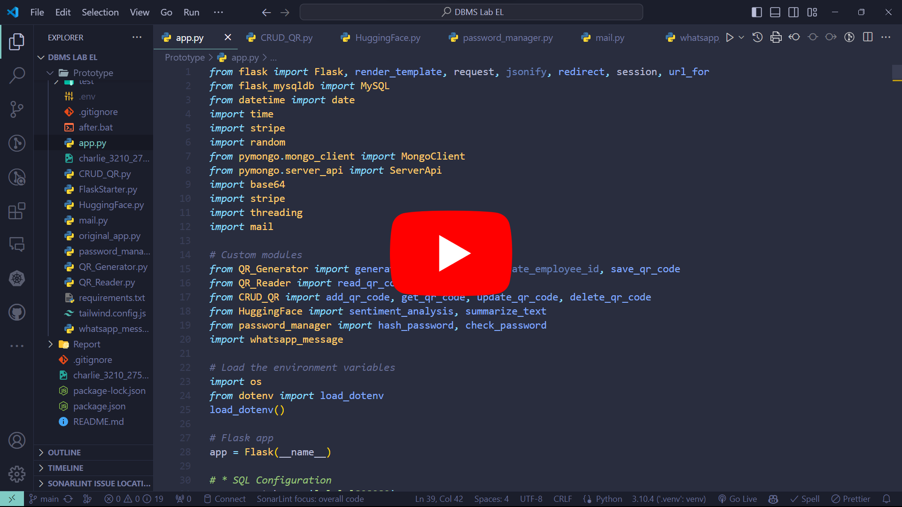

# Next Gen Car Showroom Management System

This repository contains the documents/source code associated with the Next Gen Car Showroom Management System project, developed as part of the DBMS Lab Experiential Learning component.

## Demonstration Video

[](https://youtu.be/V5ND9ySwkfw)

## Project Steps

| #   | Step                              |
| --- | --------------------------------- |
| 1.  | [Synopsis](./1_Synopsis/)         |
| 2.  | [Software Requirements](./2_SRS/) |
| 3.  | [ER Diagram](./3_ER_diagram/)     |
| 4.  | [DFD](./4_DFD/)                   |
| 5.  | [Prototype](./Prototype/)         |

## Prototype

To access the prototype, follow the steps below:

1. Change working directory to `Prototype/`

   ```bash
    cd ./Prototype/
   ```

2. Create a virtual python environment by typing the following in the terminal

   ```bash
   python -m venv .venv
   ```

3. Activate the virtual environment

   Windows:

   ```bash
   .\.venv\Scripts\activate
   ```

   Linux:

   ```bash
   source .venv/bin/activate
   ```

4. Install dependencies by typing the following in the terminal

   ```bash
   pip install -r requirements.txt
   ```

5. Run the app

   ```bash
   python app.py
   ```

6. Click on the link in the terminal to open the website

   It will look something like this:

   ```bash
   Running on http://127.0.0.1:5000
   ```

## Running the App

1. Open XAMPP and start the Apache and MySQL services.

   If MySQL is giving an error, go to services & stop the MySQL service and start it again.

2. Open the [phpMyAdmin](http://localhost/phpmyadmin/index.php?lang=en) page in the browser.

3. Create a new database named `car_showroom`.

4. **Import** the `car_showroom.sql` file into the database.

5. Open MongoDB in the browser.
